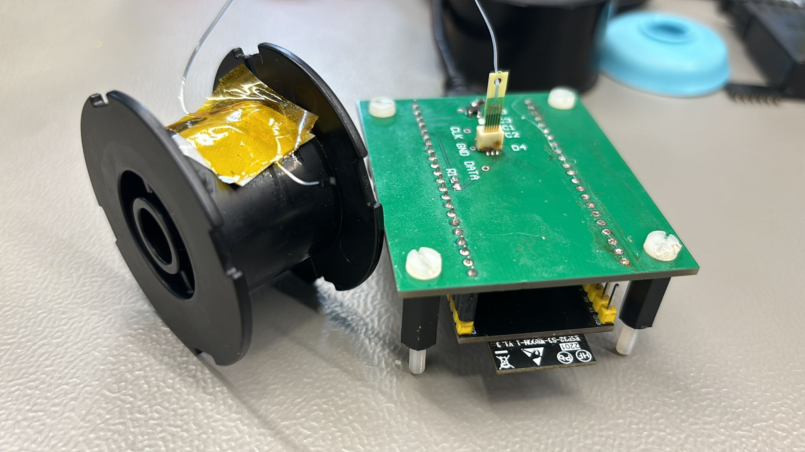
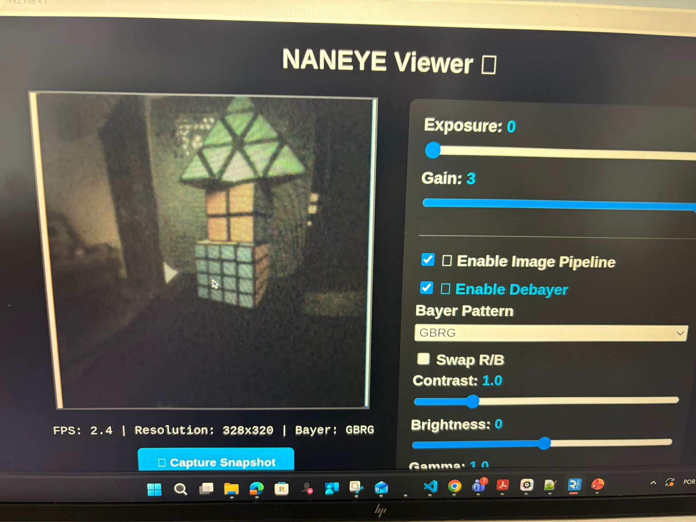
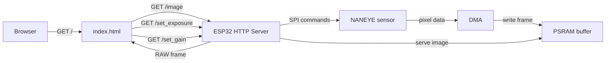

# ams OSRAM NANOSERVER NANEYE ESP32s3

<p align="center">
  
</p>

## Overview

High-speed image acquisition firmware for the **ams OSRAM NANEYE** sensor on **ESP32-S3**.

The application configures the sensor over SPI, captures 12-bit RAW frames via DMA, stores them in PSRAM using double buffering, and serves them through an embedded HTTP interface or UDP.


## Features

* 328×320 RAW 12-bit image capture
* SPI3 at 31 MHz with DMA
* Double-buffered PSRAM frame storage
* Embedded Wi-Fi Access Point
* HTTP image streaming with live sensor controls    
* Optional UDP output mode
* Runtime exposure and gain control
* Dual-core task separation

---

## Hardware

* ESP32-S3 with PSRAM
* Wi-Fi capable client device (PC, tablet, smartphone)

---

## Sensor Details

| Parameter        | Value            |
| ---------------- | ---------------- |
| Resolution       | 328 × 320 pixels |
| Pixel Format     | RAW 12-bit       |
| Bytes per Line   | 492 bytes        |
| Total Image Size | 157,440 bytes    |

---

## Architecture

The firmware splits work between two cores:

### Core 0

* Initialize SPI and DMA
* Configure the NANEYE sensor
* Capture frames into PSRAM
* Swap active read/write buffers

### Core 1

* Start Wi-Fi AP
* Run embedded HTTP server
* Serve image and control requests
* Optionally transmit UDP packets

---

## PSRAM Double Buffering

Two frame buffers are allocated in PSRAM:

* `Buffer A` — DMA writes current frame
* `Buffer B` — HTTP/UDP reads last complete frame

After each frame completion, the buffers swap roles, preventing tearing and keeping capture continuous.

---

## Connect to the ESP

1. Join the Wi-Fi network created by the ESP32.
2. Use the default credentials:
   * SSID: `NANEYE_CAM`
   * Password: `12345678`
3. Open your browser and go to:
   * `http://192.168.1.4`

<p align="center">
  
</p>

---

## Web Interface Flow

`index.html` is the browser interface served by the ESP32. It:

1. Loads the page from `/`
2. Requests `/image` for the latest RAW frame
3. Sends `/set_exposure?value=` to update exposure
4. Sends `/set_gain?value=` to update analog gain

### index.html flow diagram



---

## HTTP Endpoints

* `GET /` — serve `index.html`
* `GET /image` — return latest RAW frame (`application/octet-stream`)
* `GET /set_exposure?value=<0-255>` — update exposure
* `GET /set_gain?value=<0-3>` — update analog gain

---

## UDP Mode

Enable UDP mode by setting:

```c
#define WEBSERVER 0
#define UPD_SENDER 1
```

In UDP mode, the firmware sends lines in 494-byte packets:

* 492 bytes RAW image data
* 2 bytes line number

Default destination:

* IP: `192.168.4.2`
* Port: `5001`

---

## SPI Configuration

| Parameter | Value   |
| --------- | ------- |
| SPI Host  | SPI3    |
| Clock     | 31 MHz  |
| DMA       | Enabled |
| SPI Mode  | Mode 0  |

---

## Sensor Configuration

The firmware generates NANEYE register settings at runtime. Supported controls include exposure, ramp gain, analog gain, offset ramp, output current, bias current, VREF, high-speed mode, and idle mode.

---

## Build

Using ESP-IDF:

```bash
idf.py set-target esp32
idf.py build
idf.py flash monitor
```

---

## Project Structure

```text
.
├── main
│   ├── main.c
│   ├── index.html
│   └── ...
├── CMakeLists.txt
├── sdkconfig
└── README.md
```

---


## Author

Pedro Mendes

pedro.mendes@ams-osram.com
