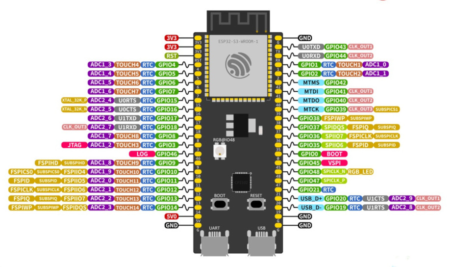
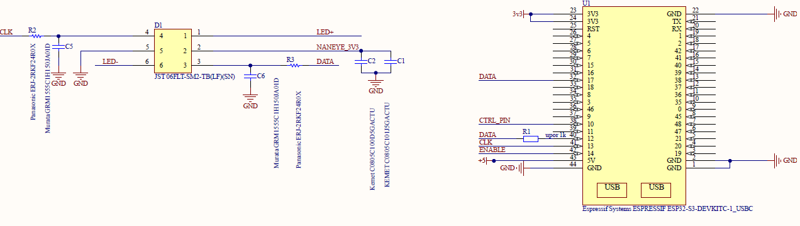
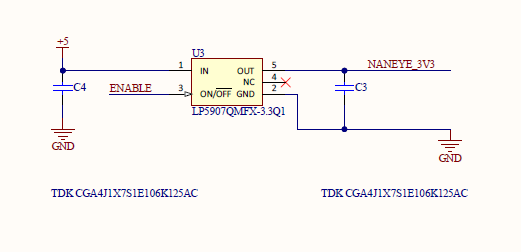
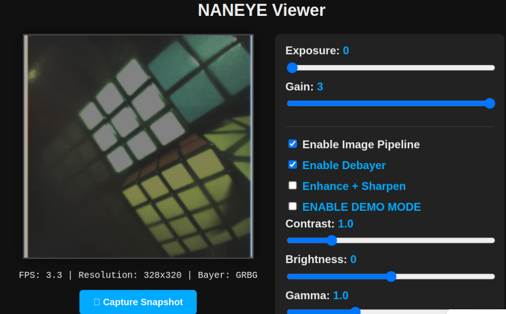

# NANOSERVER

**RAW image streaming with the ams OSRAM NANEYE on ESP32-S3**

## Overview

NANOSERVER is firmware for the ESP32-S3 that controls the ams OSRAM NANEYE image sensor, captures 12-bit RAW frames, and streams them over Wi-Fi.

The ESP32 configures the sensor via SPI, uses DMA to acquire frames, stores images in PSRAM with double buffering, and provides output through an embedded HTTP server or optional UDP stream.

<p align="center">
  
</p>

## Features

* 328×320 RAW 12-bit image capture
* SPI3 at 31 MHz with DMA
* Double-buffered PSRAM frame storage
* Built-in Wi-Fi Access Point
* Embedded HTTP interface for live image delivery
* Optional UDP frame output
* Runtime exposure and gain control
* Dual-core task separation for capture and networking

---

## Hardware

* ESP32-S3 with PSRAM

<p align="center">
  
</p>

### NANEYE wiring diagram

The NANEYE sensor has only the following signal pins:
* `DATA`
* `CLK`
* `VCC`
* `GND`

More details are available on the ams OSRAM product page: [ams NANEYE2D miniature camera module](https://ams-osram.com/products/sensor-solutions/cmos-image-sensors/ams-naneye2d-miniature-camera-module)

The ESP32 uses a shared data line for the sensor.
A 1 kΩ series resistor is placed outside the ESP32 board on the MOSI output path.

* `ESP32 MOSI` -> 1 kΩ resistor -> `NANEYE DATA`
* `ESP32 MISO` -> `NANEYE DATA`
* `ESP32 CLK` -> `NANEYE CLK`
* `3.3V` -> `NANEYE VCC`
* `GND` -> `NANEYE GND`


<p align="center">
  
</p>

The NANEYE module is powered through an external LDO. The LDO enable signal is driven by GPIO 14 on the ESP32-S3 (`GPIO_TOGGLE` in `main/NANOSERVER.c`).

<p align="center">
  
</p>

---

## Sensor Details

| Parameter        | Value            |
| ---------------- | ---------------- |
| Resolution       | 320 × 320 pixels |
| Pixel Format     | RAW 12-bit       |
| Bytes per Line   | 480 bytes        |
| Total Image Size | 153,600 bytes    |

---

## Architecture

The firmware splits work between two cores:

### Core 0

* Initialize SPI and DMA
* Configure the NANEYE sensor
* Capture frames into PSRAM
* Swap active read/write buffers

### Core 1

* Start Wi-Fi AP
* Run embedded HTTP server
* Serve image and control requests
* Optionally transmit UDP packets

---

## PSRAM Double Buffering

Two frame buffers are allocated in PSRAM:

* `Buffer A` — DMA writes current frame
* `Buffer B` — HTTP/UDP reads last complete frame

After each frame completion, the buffers swap roles, preventing tearing and keeping capture continuous.

---


[Open the CircuitMaker project](https://circuitmaker.com/Projects/6BFFED39-F093-4A0D-BEF9-0643B47B38B2)

## Connect to the ESP

1. Join the Wi-Fi network created by the ESP32.
2. Use the default credentials:
   * SSID: `NANEYE_CAM`
   * Password: `12345678`
3. Open your browser and go to:
   * `http://192.168.1.4`

<p align="center">
  
</p>

---

## ESP32 Firmware Flow

The firmware runs two independent tasks on the ESP32:

### Core 0: image capture

```text
app_main()
  -> init GPIO toggle for LDO
  -> allocate PSRAM frame buffers
  -> start core0_spi_loop()

core0_spi_loop()
  -> initialize SPI bus and sensor device
  -> send configuration frames to NANEYE
  -> read first frame to prime the pipeline
  -> loop forever:
       read one full frame by DMA
       swap write/read buffer pointers
       repeat
```

### Core 1: networking and control

```text
app_main()
  -> initialize Wi-Fi Access Point
  -> start core1_webserver()

core1_webserver()
  -> start HTTP server on port 80
  -> serve / and /image
  -> handle /set_exposure and /set_gain
  -> expose the latest frame from PSRAM
```

### Shared behavior

```text
PSRAM buffer A <-> PSRAM buffer B
DMA writer fills one buffer
HTTP server reads the other buffer
After each frame, the roles are swapped
```

---

## HTTP Endpoints

* `GET /` — serve `index.html`
* `GET /image` — return latest RAW frame (`application/octet-stream`)
* `GET /set_exposure?value=<0-255>` — update exposure
* `GET /set_gain?value=<0-3>` — update analog gain

---

## UDP Mode

Enable UDP mode by setting:

```c
#define WEBSERVER 0
#define UPD_SENDER 1
```

In UDP mode, the firmware sends lines in 494-byte packets:

* 492 bytes RAW image data
* 2 bytes line number

Default destination:

* IP: `192.168.4.2`
* Port: `5001`

---

## SPI Configuration

| Parameter | Value   |
| --------- | ------- |
| SPI Host  | SPI3    |
| Clock     | 31 MHz  |
| DMA       | Enabled |
| SPI Mode  | Mode 0  |

---

## Sensor Configuration

The firmware generates NANEYE register settings at runtime. Supported controls include exposure, ramp gain, analog gain, offset ramp, output current, bias current, VREF, high-speed mode, and idle mode.

---

## Build

Using ESP-IDF:

```bash
idf.py set-target esp32
idf.py build
idf.py flash monitor
```

---

## Project Structure

```text
.
├── main
│   ├── main.c
│   ├── index.html
│   └── ...
├── CMakeLists.txt
├── sdkconfig
└── README.md
```

---


## Author

Pedro Mendes

pedro.mendes@ams-osram.com
